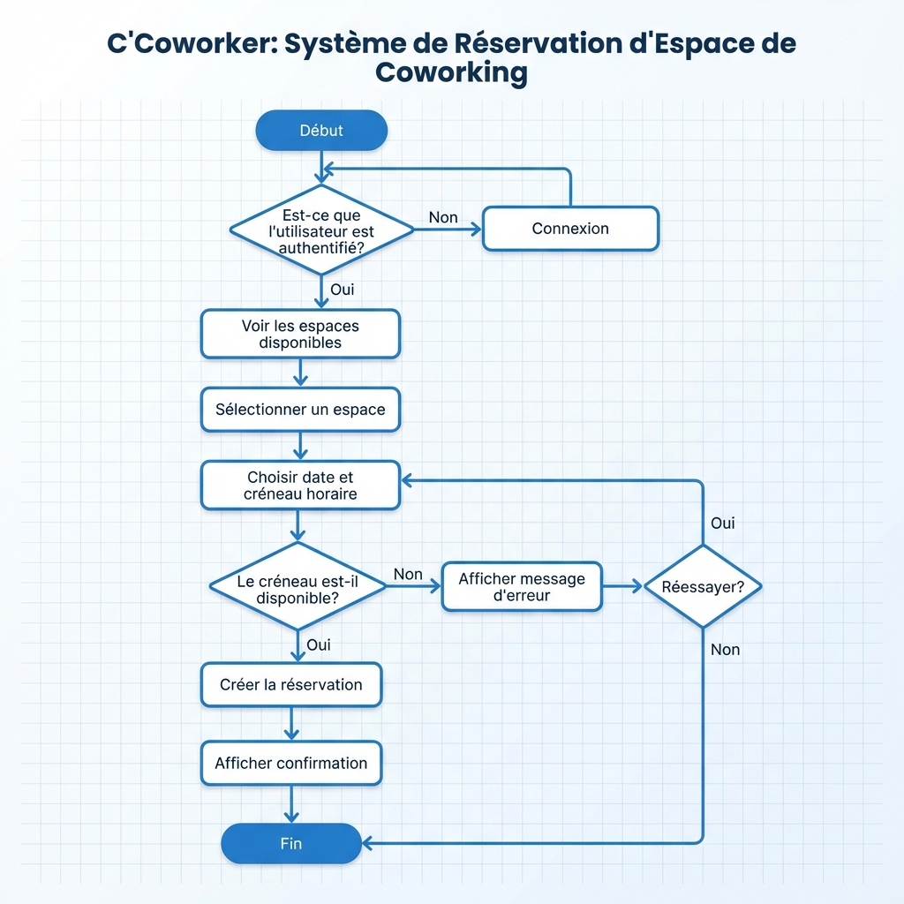
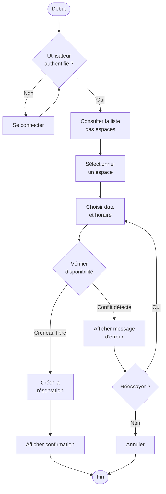
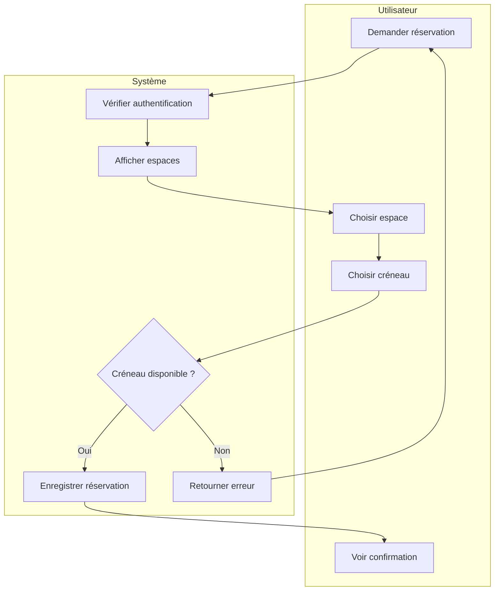

# UML - Diagramme d'Activités

## Infographie

## Processus : Création d'une Réservation

Ce diagramme modélise le flux d'activité lorsqu'un utilisateur souhaite réserver un espace.

### Description Textuelle

**Acteurs :** Utilisateur (User ou Admin)

**Flux principal :**
1. L'utilisateur se connecte au système
2. L'utilisateur consulte la liste des espaces disponibles
3. L'utilisateur sélectionne un espace
4. L'utilisateur choisit une date et un créneau horaire
5. Le système vérifie la disponibilité (détection de conflits)
6. Si disponible : la réservation est créée et confirmée
7. Si indisponible : un message d'erreur est affiché et l'utilisateur peut modifier sa demande

**Points de décision :**
- Authentification réussie ?
- Créneau disponible ?

### Swimlanes (Couloirs)

On peut également représenter les responsabilités par acteur :

---

**Règles métier illustrées :**
- Un utilisateur doit être authentifié pour réserver
- Le système empêche les doubles réservations (détection automatique des conflits)
- L'utilisateur peut réessayer avec un autre créneau en cas de conflit
