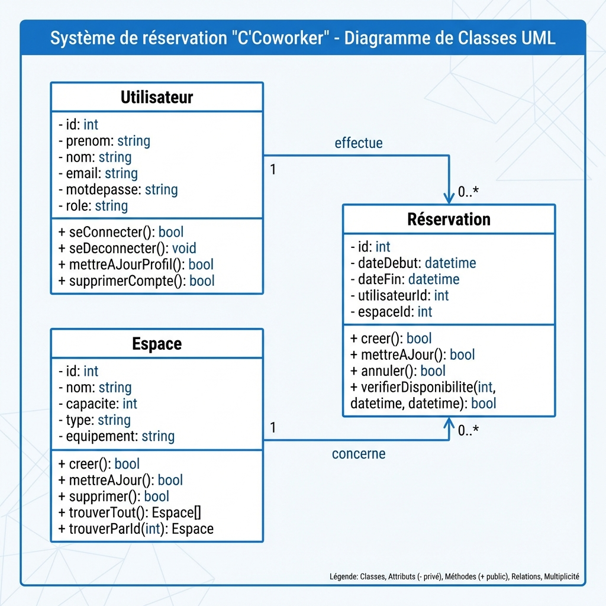
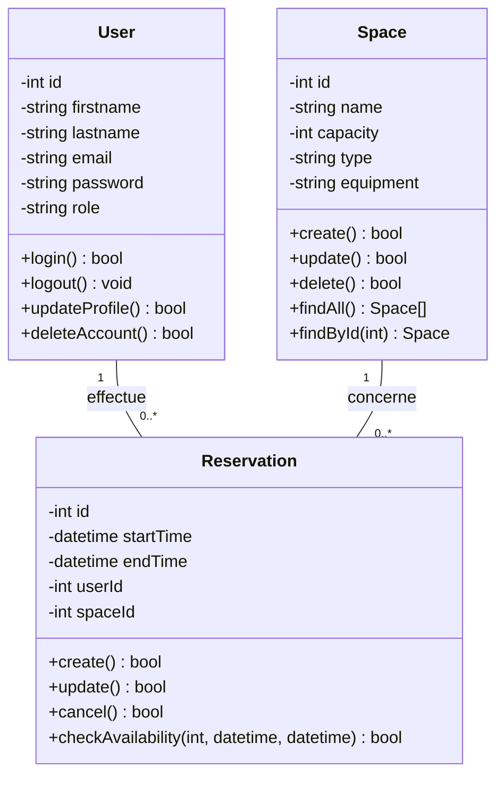

# UML - Diagramme de Classes

## Infographie

## Description

Ce diagramme modélise les classes principales du système C'Coworker et leurs relations.

### Classes Métier

1. **User (Utilisateur)**
   - Attributs : id, firstname, lastname, email, password, role
   - Méthodes : login(), logout(), updateProfile(), deleteAccount()

2. **Space (Espace)**
   - Attributs : id, name, capacity, type, equipment
   - Méthodes : create(), update(), delete(), findAll(), findById()

3. **Reservation**
   - Attributs : id, startTime, endTime, userId, spaceId
   - Méthodes : create(), update(), cancel(), checkAvailability()

### Relations

- **User** `1` ──── `0..*` **Reservation** : Un utilisateur effectue 0 ou plusieurs réservations
- **Space** `1` ──── `0..*` **Reservation** : Un espace concerne 0 ou plusieurs réservations

### Cardinalités

- `1` : Un et un seul
- `0..*` : Zéro ou plusieurs
- `1..*` : Un ou plusieurs

### Visibilité

- `-` : Privé (private)
- `+` : Public (public)
- `#` : Protégé (protected)
