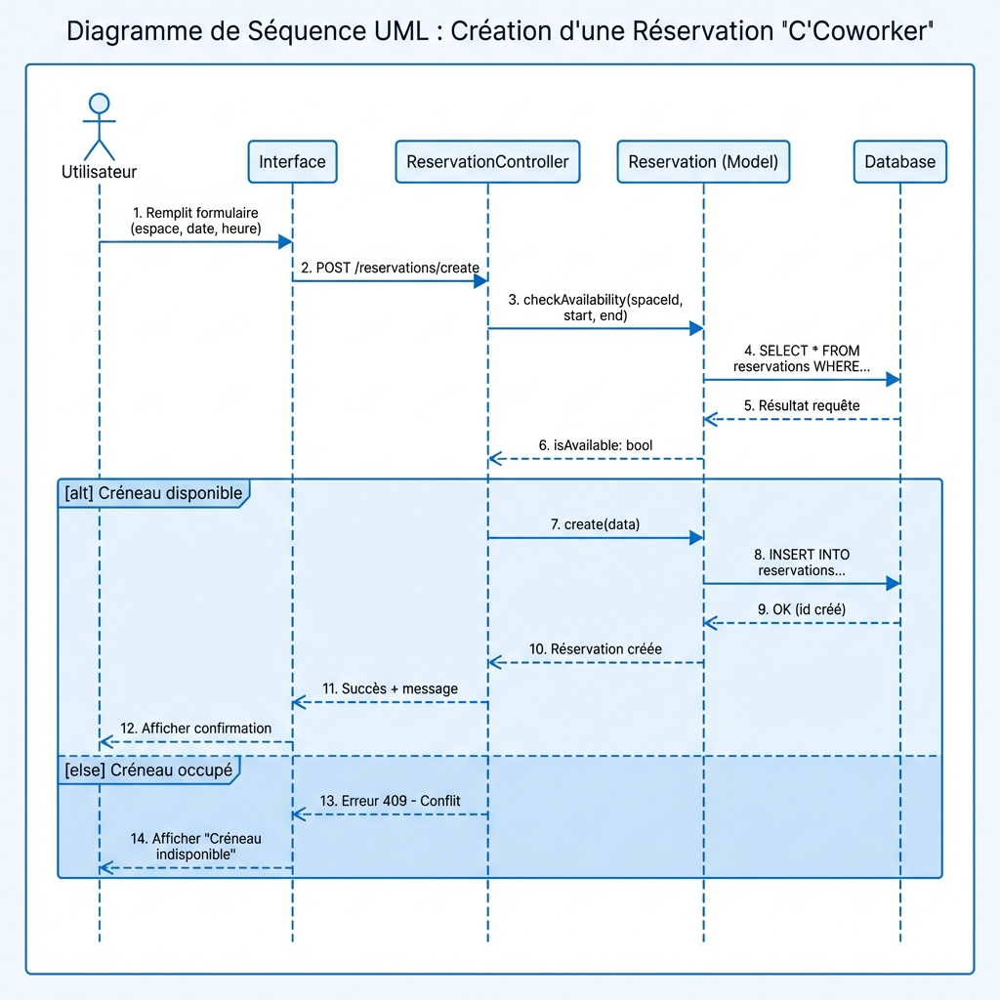
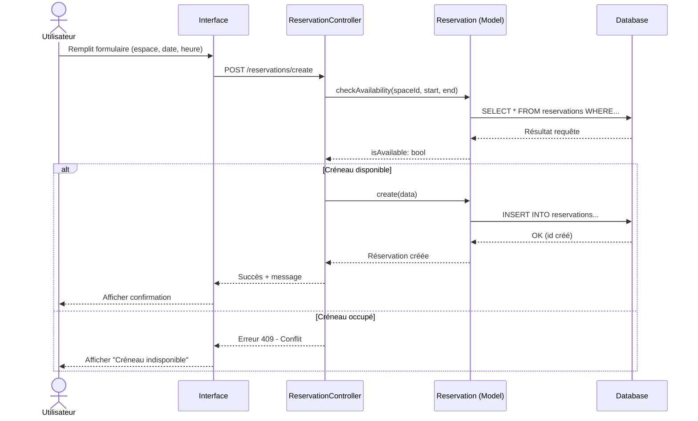

# UML - Diagramme de Séquence

## Infographie

## Scénario : Créer une Réservation

Ce diagramme montre les interactions entre les objets lors de la création d'une réservation.

### Acteurs et Objets

- **Utilisateur** : L'acteur qui effectue l'action
- **Interface** : L'interface utilisateur (formulaire)
- **ReservationController** : Contrôleur gérant la logique
- **Reservation (Model)** : Modèle de données
- **Database** : Base de données MySQL

### Flux d'Interactions

1. L'utilisateur remplit le formulaire de réservation
2. L'interface envoie la demande au contrôleur
3. Le contrôleur vérifie la disponibilité du créneau
4. Si disponible, la réservation est créée en base
5. Une confirmation est retournée à l'utilisateur

### Éléments UML

- **Message synchrone** : Flèche pleine `->>`
- **Message de retour** : Flèche pointillée `-->>`
- **Fragment alternatif** : `alt` / `else` (si/sinon)
- **Ligne de vie** : Barre verticale sous chaque participant
