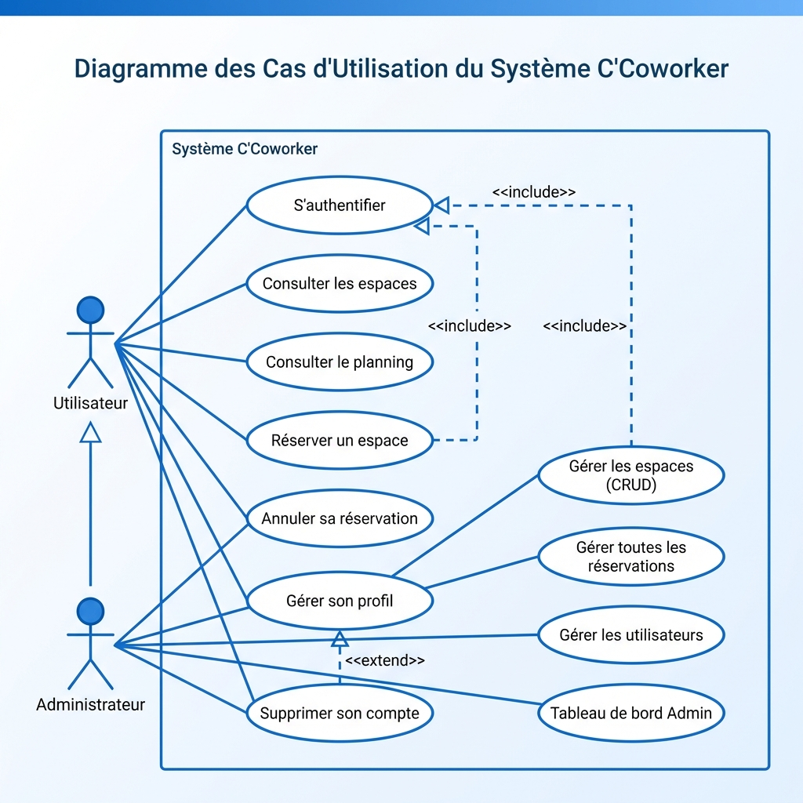
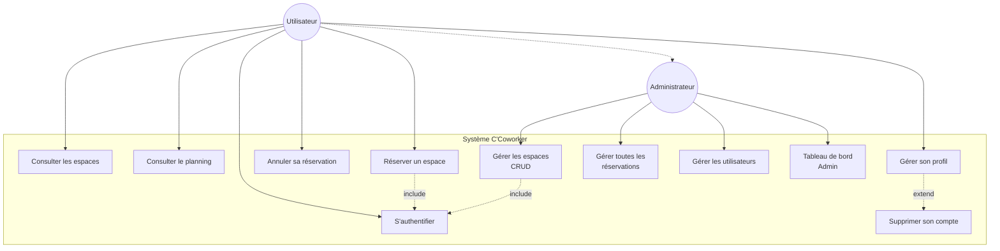

# UML - Diagramme de Cas d'Utilisation

## Infographie

## Vue d'Ensemble

Ce diagramme présente les fonctionnalités du système C'Coworker et les interactions entre les acteurs et le système.

### Acteurs

1. **Utilisateur (User)** : Employé ou membre utilisant les espaces de coworking
2. **Administrateur (Admin)** : Hérite de Utilisateur, avec des privilèges étendus

### Cas d'Utilisation

**Fonctionnalités Utilisateur :**
- S'authentifier
- Consulter les espaces disponibles
- Consulter le planning de réservation
- Réserver un espace
- Annuler sa réservation
- Gérer son profil utilisateur
- Supprimer son compte (extend de "Gérer son profil")

**Fonctionnalités Administrateur :**
- Gérer les espaces (CRUD : créer, modifier, supprimer)
- Gérer toutes les réservations
- Gérer les utilisateurs
- Consulter le tableau de bord administrateur

### Relations

- **<<include>>** : Relation de dépendance obligatoire (ex: Réserver un espace inclut S'authentifier)
- **<<extend>>** : Relation optionnelle (ex: Supprimer son compte étend Gérer son profil)
- **Héritage** : Admin hérite de User (représenté par une flèche blanche)

### Notation

- **Ovale** : Cas d'utilisation
- **Stick figure** : Acteur
- **Ligne pleine** : Association
- **Ligne pointillée** : Relation include/extend
- **Flèche blanche** : Héritage d'acteur
